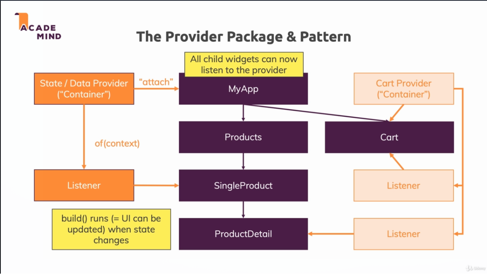
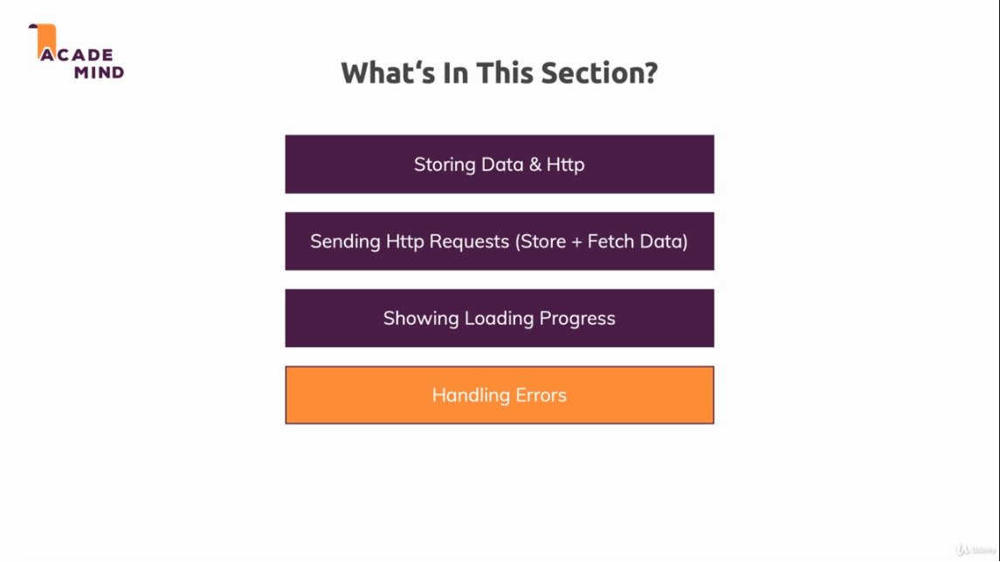

# Section 10: Shopps App (HTTP)

This is the repository for the Flutter course ([Flutter and Dart - The Complete Guide](https://www.udemy.com/course/learn-flutter-dart-to-build-ios-android-apps/))
In this section I'll be building an Shopps app, specifically in this section, I'll tackle how to use Animations
with Flutter.

In here all my commits will be made with comments and the title of the lesson.

## Provider Package

This is a pattern enforced by the Flutter team to deal with application wide state. It uses the
InheritedWidget behind the scenes



## HTTP Module Roadmap



## Sections

The course sections / lessons will be organized as commits, for instance:
The Section 2: The Basics

```t
  "[section number] : [lesson number and title]"
```

## Authors

* **Eduardo Lima** - du-almeidalima
